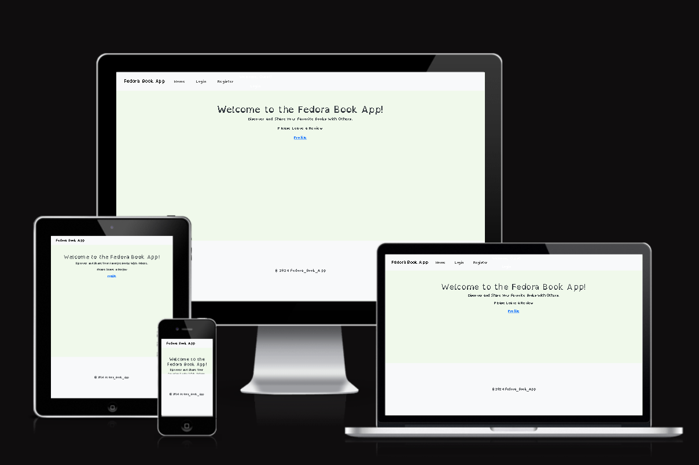

# fedora_book_app - Testing

[View Fedora_book_app on Heroku](https://fedora-book-app-66de4d4087a8.herokuapp.com/)

## CONTENTS

-[Automated Testing]#(Automated-Testing)
 -[W3C Validator](#W3C-Validator)
 - [JavaScript Validator](#JavaScript-Validator)
  - [Lighthouse Testing](#Lighthouse-Testing)
  - [Wave Testing](#Wave-Testing)
  - [CI Python Linter](#ci-python-linter)
- [Manual Testing](#Manual-Testing)
  - [Testing User Stories](#Testing-User-Stories)
  - [Full Testing](#Full-Testing)
- [Bugs](#bugs)
  - [Solved Bugs](#solved-bugs)
  - [Known Bugs](#known-bugs)

## Testing

Testing was continuous throughout the website build. I used Chrome developer tools to identify and address any issues as they arose.

My automated testing consisted of using W3C Validator, Lighthouse, Wave, and the CI Linter Python.
I then manually tested the user stories along with the functionality of the website.
Automated Testing
W3C Validator
W3C validator was used to validate the HTML on all pages of the website. It was also used to validate CSS in the style.css file.

All pages pass the W3C validator.

Home Page

Login Page

Register Page

Search Page

Search Results Page

Book Reviews Page

404 Page

500 Page

CSS

Lighthouse Testing
I took the opportunity to utilize Lighthouse within Chrome Developer Tools. This allowed me to test for performance, accessibility, best practices, and the SEO (search engine optimization) of the website.

All pages pass Google’s Lighthouse tests for Desktop and Mobile.
Desktop Testing

Lighthouse Desktop Testing Screen Shots

Home Page

Login Page

Register Page

Search Page

404 Page

500 Page

Mobile Testing

Lighthouse Mobile Testing Screen Shots

Home Page

Login Page

Register Page

Search Page

Book Reviews Page

404 Page

500 Page

Wave Testing

Wave Testing Screen Shots

All pages pass the Wave validator.

Home Page

Login Page

Sign Up Page

Search Page

Add Review Page

Edit Review Page

Delete Review Page

404 Page

500 Page

CI Python Linter
All Python code is consistent in style and conforms to the PEP8 style guide. The CI Python Linter has been used to check that the code conforms to PEP8 standard. This includes indentation, comments, trailing white spaces, maximum line length, etc.
All pages have passed the CI Python Linter.

init.py

models.py

routes.py

### Manual Testing

### Testing User Stories

### First-Time Visitors

| Goals                                                        | How are they achieved?                                                                                                         |
| :----------------------------------------------------------- | :----------------------------------------------------------------------------------------------------------------------------- |
| Register for an account                                    | There is a sign up link on the home page which encourages a user to create an account.
| Search for movies | Once a user has signed up to an account. They can search for a movie by clicking the 'Review A Movie' nav link.
| Understand what the site is for and easily navigate their way around                          |   A description of what the site is is included on the home page.                                         |
| I want the website to be responsive across varying devices.  | Bootstrap has been used in order to make ReelTalk responsive across a variety of devices.                               |

#### Returning Visitors and Frequent Visitors

| Goals                                                                    | How are they achieved?                                                                                                                                                              |
| :----------------------------------------------------------------------- | :---------------------------------------------------------------------------------------------------------------------------------------------------------------------------------- |
| Log into created account.                 |  If a user is not logged into an account, a login link is provided on the navbar and home page.                                              |
|Create, edit and delete my own reviews. | A user has access to all of their reviews on the 'My Reviews Page' from here the user can edit and delete any existing reviews. They can create a new review by clicking on the 'Review A Movie' link. This allows a user to search for a movie and create a review.  |
|Read other users reviews. | All reviews for all reviewed movies are displayed on the 'Movie Review' page. |

### User Testing Summary

On the whole ReelTalk is an engaging, user-friendly website that sucessfully meets the needs of movie lovers by providing a centralized community for sharing and discovering movie reviews. ReelTalk offers a comprehensive, up-to-date movie database by leveraging the TMDB database, this enhances the user's ability to search for and review films. The website focuses on user-generated content, providing a perspective from everyday moviegoers rather than relying on professional critics. Users can easily navigate the site, manage their reviews and enjoy a personalised experience, thanks to the websites accessible and intuitive interface. Security features such as authentications and authorization ensure the users can safely manage their own content. 

Whether you're a first time visitor, returning user or a frequent reviewer, ReelTalk offers a tailored experience that meets the needs of it's target audience. Which I believe makes the website a success and meets all of the initial goals set prior to creating the website. 

### Full Testing

Full testing was performed on the following devices:

- Laptop:

  - Lenovo V15 G2 ITL 15" Screen

- Mobile Devices:
  - iPhone 15 pro.
  - iPhone 12 pro.
  - iPhone 11 pro.

Each device tested the site using the following browsers:

- Google Chrome
- Safari

#### Home Page

| Feature                                            | Expected Outcome                                                       | Testing Performed                  | Result                                                      | Pass/Fail |
| -------------------------------------------------- | ---------------------------------------------------------------------- | ---------------------------------- | ----------------------------------------------------------- | --------- |
|Register button (logged out users only)                                    | Link directs the user to the Register page                            | Clicked sign up button                      | Redirected to the Register page                                           | Pass      |
| Login link (only shown if user is not logged in)                             | Directs user to the login page                                      | Clicked link                       | Redirected to the login page                                           | Pass      |
Pass      |

#### Register Page

| Feature                                            | Expected Outcome                                                       | Testing Performed                  | Result                                                      | Pass/Fail |
| -------------------------------------------------- | ---------------------------------------------------------------------- | ---------------------------------- | ----------------------------------------------------------- | --------- |
| First name input                                    | The users first name should be more than 2 characters long                            | Entered first name less than 2 characters long                      | Flash message alerts the user they have not entered enough characters                                           | Pass      |
| Last name input                                    | The users should enter their last name                            | Entered last name                       |                                            | Pass      |
| Email input                                    | The users email should be more than 4 characters long                            | Entered email less than 4 characters long                      | Flash message alerts the user they have not entered enough characters                                           | Pass      |
| Email input (already in use)                                    | The users email must be unique                            | Entered email which already exists in the database                     | Flash message alerts the user that the email is already in use characters                                           | Pass      |
| Password input                                    | The users password should be between 8 and 20 characters long                            | Entered password less than 8 and more than 20 characters long                      | Flash message alerts the user they have not matched the correct criteria                                          | Pass      |
| Confirm password input                                    | The users password should match the password input field                            | Entered password which differs from the password input field                      | Flash message alerts the user that the passwords do not match                                          | Pass      |
| Sign up button                                    | Link directs the user to the home page and displayed a message indicating the user has been created                            | Clicked sign up button                      | Redirected to the home page. Flash message displayed                                           | Pass      |

#### Login Page

| Feature                                            | Expected Outcome                                                       | Testing Performed                  | Result                                                      | Pass/Fail |
| -------------------------------------------------- | ---------------------------------------------------------------------- | ---------------------------------- | ----------------------------------------------------------- | --------- |
| Email input                                    | User to enter e-mail address                            | Enter email address                     | Flash message alerts the user if the email doesn't exist in the database                                           | Pass      |
| Password input                                    | User to enter password                            | Enter password                     | Flash message alerts the user if the password is incorrect                                           | Pass      |
| Login button                                    | Directs the user to the 'My Reviews' page and a flash message appears with 'Successful Login'                            | Click button                     | Redirected to the 'My Reviews' page                                           | Pass      |

#### Search Books Page

| Feature                                            | Expected Outcome                                                       | Testing Performed                  | Result                                                      | Pass/Fail |
| -------------------------------------------------- | ---------------------------------------------------------------------- | ---------------------------------- | ----------------------------------------------------------- | --------- |
| Search input                                  | User to enter a book title                           | book title entered                     | The search returns the movie title                                         | Pass      |
| Search input (No result)                                  | User to enter a movie title                           | book title entered                     | Flash message indicates there is no such book title                                         | Pass      |
| Search button                                  | Directs user to search results page                           | Clicked button                     | Redircted to the search results page                                        | Pass      |

| book card                                  | Once clicked directs the user to the review page                           | Clicked book card                     | Redircted to the reviews page                                         | Pass      |
| book card image                                  | If no image is returned from the TMDB API a stock image is displayed                           | Searched for book with no image                     | Stock TMDB image displayed                                         | Pass      |

#### Review Page

| Feature                                            | Expected Outcome                                                       | Testing Performed                  | Result                                                      | Pass/Fail |
| -------------------------------------------------- | ---------------------------------------------------------------------- | ---------------------------------- | ----------------------------------------------------------- | --------- |
| Text input                                  | User to enter their review (this is a required field)                           | Review entered                     | Review saved to the database with a flash message of success                                         | Pass      |
| Submit review button                                  | User is directed to their 'My Reviews' page and a sucess message is displayed                           | Clicked submit review button                     |  User redirected to the 'My Reviews' page and success message displayed                                       | Pass      |

#### 403 & 404 Pages

| Feature                                            | Expected Outcome                                                       | Testing Performed                  | Result                                                      | Pass/Fail |
| -------------------------------------------------- | ---------------------------------------------------------------------- | ---------------------------------- | ----------------------------------------------------------- | --------- |
| 404 - User tries to access a page which doesn't exist on the website                               | 404 page is displayed                           | Tried to access a webpage which doesnt exist on the website                     | 404 page displayed                                          | Pass      |

## Bugs

### Known Bugs

| # | Bug | 
| :--- | :--- | 
| 1 | The release date for each book returned from the API is in US format. The date is used on each of the book cards across the website. Eventually I would like to rectify the issue by converting the dates to UK format to match the review created date |